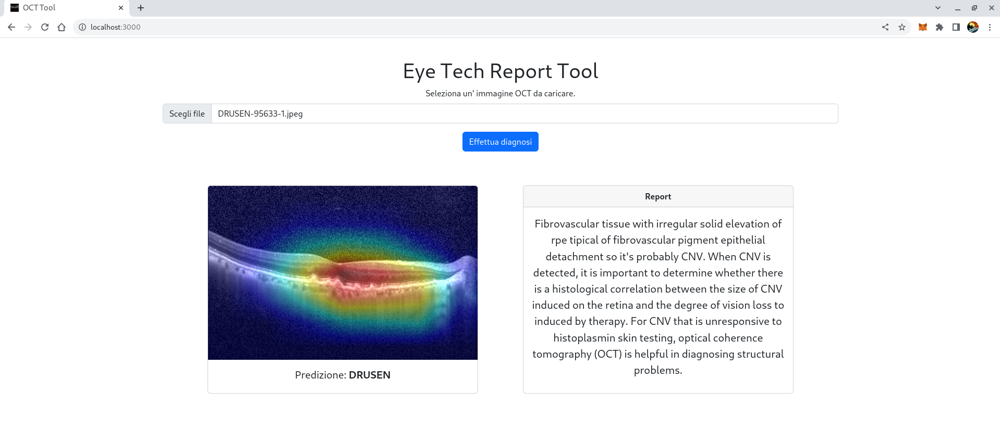

# XAI_OCT
Una metodologia di Explainable AI per la diagnosi di malattie da Tomografia Ottica Computerizzata (OCT)

## ABSTRACT
Sempre più specialisti del settore sanitario fanno uso di sistemi di Intelligenza Artificiale (AI) per un supporto nel processo diagnostico: recenti modelli di Deep Learning sono in grado di classificare immagini biomediche con un alta accuratezza. Tuttavia, la maggior parte di essi sono utilizzati con un livello di astrazione molto elevato, ossia senza effettivamente conoscere il criterio con il quale si è arrivati ad una determinata predizione. L'esigenza di una maggior comprensione ha portato alla diffusione di nuovi modelli di Explainable AI (XAI) che sono in grado di dare indizi che giustificano la decisione presa da un classificatore grazie all'ausilio di elementi testuali e visivi. Questo lavoro di tesi implementa tali meccanismi nel settore dell'oftalmologia. In particolare viene affrontato lo studio delle patologie più comuni che colpiscono la retina tramite l'analisi di immagini OCT (Tomografia ottica computerizzata) su malattie dovute alla degenerazione maculare senile, come DRUSEN e neovascolarizzazione coroideale (CNV) e l'edema maculare diabetico (DME). Questa ricerca si concretizza nello sviluppo di un sistema intelligente rivolto sia al supporto medico e sia al paziente, il quale sarà capace di ricevere una prima indicazione sulle proprie condizioni di salute. L'implementazione fa uso di reti convoluzionali per il task di classificazione; Densenet-161 raggiunge un accuracy del 92.75\% su immagini di dimensione ridotta; Densenet-121 e VGG-19, invece, sono state addestrate su immagini OCT con maggior dettaglio per fornire oltre alla classificazione anche una Explainability visiva che consiste in una mappa di calore sovrapposta all'immagine al fine di marcare le aree di maggior criticità; le due reti hanno ottenuto rispettivamente un accuratezza del 91.67\% e del 93.06\%. Inoltre, si presenta un'architettura CNN-LSTM che genera una breve descrizione della scansioni OCT data in input; quest'ultima viene indirizzata ai Transformers GPT-2 e GPT-Neo che generano del contesto per un documento di reporting diagnostico. Tutte le componenti del sistema sono state riadattate in un unico modello che risolve tutti i task congiuntamente raggiungendo il 98\% di accuracy, evidenziando come la correlazione tra compiti aumenti le perfomance.
